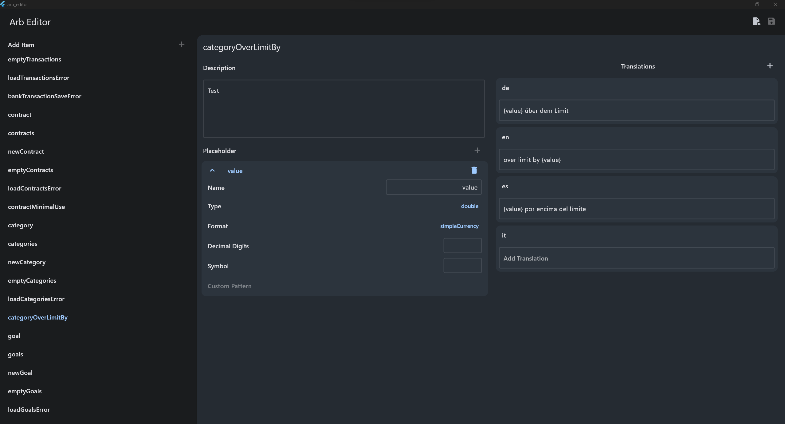

# Arb Editor

This is a weekend project to simplify the editing arb translations files. Simply select an l10n.yaml file and start editing existing translations or adding new ones. When you are done, just click on save and all arb files will be updated and missing ones will be created.

## Features
- add and edit translations
- manage placeholders
- add new languages
- search

## Disclaimer
Since I programmed this tool one weekend the focus was on getting things working and not creating high quality code. Error handling is not really implemented either. As I will use this tool for my other projects, there will be some improvements, but don't expect a high quality tool.

Some features I will possibly implement in the future:
- warnings for missing or unknown placeholders in translations